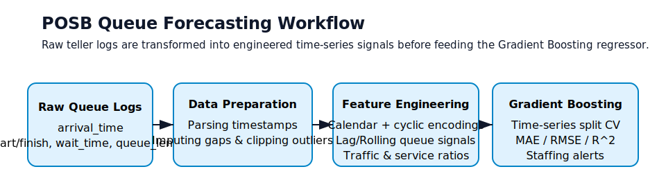
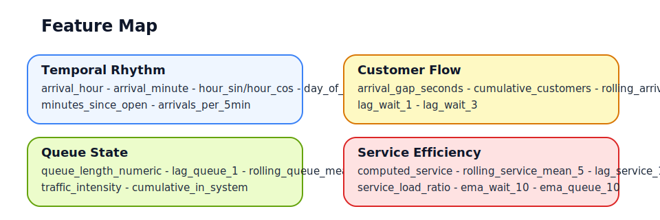
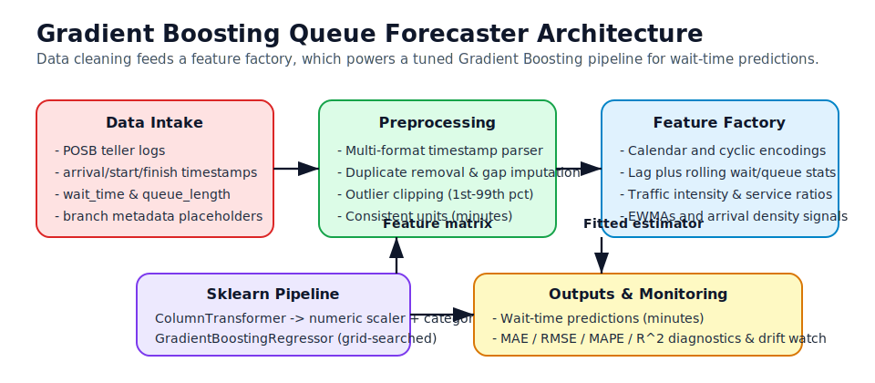

# Gradient Boosting Queue Forecasting

Predict queue waiting times for People's Own Savings Bank (POSB) branches using a feature-rich Gradient Boosting regressor that understands arrival rhythms, queue dynamics, and service efficiency metrics. The end goal is to arm branch managers with minute-level forecasts so they can balance staffing, trigger proactive messaging, and consistently hit the Agenda 2063/NDS performance targets.



## Business Understanding
- **Pain point**: High customer inflow plus uneven teller availability leads to unpredictable wait times and long in-branch queues.
- **Objective**: Estimate the wait time for the *next* customer the moment they grab a ticket, enabling smarter teller allocation and customer updates.
- **Success metrics**: Lower average wait time, reduce 90th percentile wait spikes, and keep the wait-time MAE under an agreed SLA (e.g., +/- 5 minutes).

## Data & Sources
| File | Description |
| --- | --- |
| `queue_data1.csv` | Cleaned/augmented log of arrivals, service start/finish, self-reported wait_time, and queue_length. |
| `queue_data.csv` | Earlier raw export kept for comparison/backups. |
| `GB-queue-notebook.ipynb` | Single-source analysis that covers data profiling, feature engineering, modeling, and evaluation. |

Key fields:
- `arrival_time`, `start_time`, `finish_time` - numerous timestamp formats (human typed plus epoch), parsed and normalized in the notebook.
- `wait_time`, `queue_length` - numeric columns that may arrive as strings and contain outliers/improper blanks.

## Feature Engineering Highlights
The notebook builds 25+ predictors that capture both short-term congestion and longer seasonal patterns. The SVG below groups them:



- **Temporal rhythm**: `arrival_hour`, `hour_sin/cos`, `day_of_week`, `month`, `is_weekend`, and `minutes_since_open`.
- **Queue state**: `queue_length_numeric`, `rolling_queue_mean_5`, `traffic_intensity`, `cumulative_in_system`.
- **Customer flow**: `arrivals_per_5min`, `arrival_gap_seconds`, `rolling_arrival_gap_mean_5`, `cumulative_customers`.
- **Service efficiency**: `computed_service`, `rolling_service_mean_5`, `service_load_ratio`, plus lags/exponentially weighted means for both wait and queue length.

Outliers are clipped to the 1st-99th percentile band, missing queue/service values are median-imputed, and short rolling/lag features are filled with recent medians to avoid leakage.

## Model Architecture at a Glance
The model is a single scikit-learn pipeline that chains preprocessing, feature engineering, and a tuned Gradient Boosting head:



Data ingestion and cleaning feed a feature factory that emits the numeric/categorical matrix consumed by the pipeline (ColumnTransformer -> GradientBoostingRegressor). Hold-out metrics and residual tracking close the loop for monitoring.

## Model Design
1. **Preprocessing**: `ColumnTransformer` branches into
   - Numeric pipeline -> `SimpleImputer(strategy="median")` + `StandardScaler`.
   - Categorical pipeline (`day_of_week`, `month`) -> `SimpleImputer(strategy="most_frequent")` + `OneHotEncoder(handle_unknown="ignore")`.
2. **Baseline sanity checks**: `DummyRegressor` (mean/median) establishes naive MAE/RMSE targets.
3. **Core model**: `GradientBoostingRegressor` tuned with `GridSearchCV` over:
   - `n_estimators` 200-300, `learning_rate` 0.05-0.1, `max_depth` 2-3.
   - `min_samples_leaf` 10-40, `subsample` 0.6-0.8, `max_features` {None, 0.7}.
4. **Evaluation strategy**:
   - Chronological 75/25 split keeps temporal order intact.
   - `TimeSeriesSplit(n_splits=5)` inside grid-search plus an outer hold-out evaluation.
   - Metrics tracked throughout: MAE, RMSE, MAPE (safe denominator), and R^2. Residual plots and time-series residual traces highlight regime shifts or drift.
5. **Explainability**: Feature importances are extracted post-fit to surface the operational levers (e.g., `arrivals_per_5min`, `traffic_intensity`, `service_load_ratio`).

## Notebook Tour - What Each Code Block Does
| Section in notebook | Purpose |
| --- | --- |
| `1. Business Understanding` | States the POSB context, KPIs, and why a forecasting model matters. |
| Imports & globals | Pulls core scientific Python stack, configures plotting aesthetics, and asserts that `queue_data1.csv` exists. |
| `2. Data Understanding` | Loads the CSV, prints dataset shape, `.head()`, `.info()`, summary stats, and missing-value audit. |
| Exploratory visuals | Scatter of wait vs queue length plus wait-time histogram for an initial sense of variance. |
| `3. Data Preparation` | Robust timestamp parser (`KNOWN_FORMATS` + epoch fallback), duplicate removal, missing value handling, service/wait recomputation, and outlier clipping. |
| Feature engineering block | Adds calendar fields, cyclic encodings, rolling means, EWMA trends, traffic ratios, lagged wait/service/queue values, and aggregated arrival counts. |
| Additional exploratory visuals | Multi-panel chart to inspect engineered series, arrival intensity, and correlations. |
| Modeling setup | Defines modeling columns, chronological train/test split, preprocessing pipelines, and helper metric utilities (MAE/RMSE/MAPE/R^2). |
| Baselines & `GradientBoostingRegressor` grid search | Fits dummy models, then performs time-series cross-validated hyperparameter search. |
| Evaluation + residual diagnostics | Generates actual vs predicted scatter, residual distribution, time-based residual trace, tabular metrics, and percentile error summary. |
| Feature importance + cross-validation | Visualizes top drivers and reports fold-level MAE/RMSE/R^2 stability. |

## How to Run It Yourself
1. **Create a virtual environment**
   ```bash
   python -m venv .venv
   .venv\Scripts\activate  # PowerShell
   ```
2. **Install dependencies**
   ```bash
   pip install pandas numpy scikit-learn seaborn matplotlib python-dateutil notebook
   ```
3. **Launch Jupyter**
   ```bash
   jupyter notebook GB-queue-notebook.ipynb
   ```
4. **Execute cells top-to-bottom**
   - Update `DATA_PATH` if you place the CSV elsewhere.
   - The grid-search section can take a few minutes; adjust the parameter grid or `n_jobs` if you want a quicker dry run.

## Interpreting / Extending the Model
- Inspect the residual diagnostics to spot dayparts where the model consistently over- or under-predicts.
- Use the feature-importance table to design operational levers (e.g., if `arrivals_per_5min` dominates, consider proactive messaging when it spikes).
- Consider exporting the fitted pipeline with `joblib` and wrapping it in a FastAPI/Flask service for real-time scoring.
- Add new signals such as teller availability, branch IDs, or weather to boost predictive power and enable multi-branch training.

## Repository Structure
```
.
|-- docs/
|   |-- images/
|       |-- pipeline.svg        # Workflow visual used in this README
|       \-- feature_map.svg     # Feature grouping cheat sheet
|-- GB-queue-notebook.ipynb     # Main experimentation notebook
|-- queue_data1.csv             # Primary modeling dataset
\-- queue_data.csv              # Raw/legacy dataset
```

## Next Steps
1. Export the tuned Gradient Boosting pipeline, wrap it in a lightweight API, and schedule periodic retraining as new queue logs land.
2. Track live MAE/RMSE on recent data to detect drift; re-trigger grid-search if metrics cross alerting thresholds.
3. Experiment with gradient boosting variants (XGBoost, LightGBM) or sequence models (Temporal Fusion Transformer) if richer telemetry is added.

Feel free to adapt the notebook into modular Python scripts once you are ready for productionization; the preprocessing + model pipeline already fits neatly inside scikit-learn's Pipeline abstraction.
